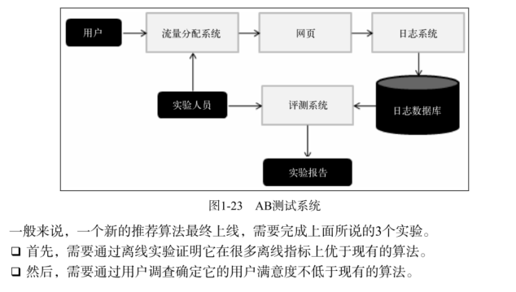
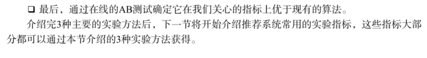

#### 1.什么是推荐系统
    矛盾：作为信息生产者，如何让自己生产的信息脱颖而出，受到广大用户的关注，是一件非常困难的事情。
- **推荐系统**就是解决这一矛盾的重要工具。  
  
  推荐系统的任务就是联系用户和信息，一方面帮助用户发现对自己有价值的信息，另一方面让信息能够展现在对它感兴趣的用户面前，从而实现信息消费者和信息生产者的双赢。
  - 为了解决信息过载的问题，代表性的解决方案是**分类目录**和**搜索引擎**。代表公司分别是：雅虎和谷歌。
  - 和搜索引擎一样，推荐系统也是一种帮助用户快速发现有用信息的工具。
  - 和搜索引擎不同的是，推荐系统不需要用户提供明确的需求，而是通过分析用户的历史行为给用户的兴趣建模，从而主动给用户推荐能够满足他们兴趣和需求的信息。  
  
- 从某种意义上说，推荐系统和搜索引擎对于用户来说是两个互补的工具。搜索引擎满足了用户有明确目的时的主动查找需求，而推荐系统能够在用户没有明确目的的时候帮助他们发现感兴趣的新内容。
- 从物品的角度出发，推荐系统可以更好地发掘物品的长尾（long
  tail）。【传统的80/20原则（80%的销售额来自于20%的热门品牌）在互联网的加入下会受到挑战。
- 长尾大概意思就是指那些非热门品牌部分。
- 主流商品往往代表了绝大多数用户的需求，而长尾商品往往代表了一小部分用户的个性化需求。

#### 2.推荐系统工作方式
- 社会化推荐（social recommendation）：让大伙推荐电影
+ 基于内容的推荐 （content-based filtering）：根据之前看过的电影找到其他喜欢的电影
- 基于协同过滤（collaborative filtering）：找到和自己历史兴趣相似的一群用户，结合这群用户找到
+ 基于物品推荐算法

__用户和物品联系起来的方式：利用好友、用户的历史兴趣、注册信息等__

通过以上的讨论，可以发现推荐系统就是自动联系用户和物品的一种工具，它能够在信息过载的环境中帮助用户发现令他们感兴趣的信息，也能将信息推送给对它们感兴趣的用户。

#### 3.个性化推荐系统的应用
    
	- 个性化推荐系统在这些网站中的主要作用是通过分析大量用户行为日志，给不同用户提供不同的个性化页面展示，来提高网站的点击率和转化率。
	- 几乎所有的推荐系统应用都是由前台的展示页面、后台的日志系统以及推荐算法系统3部分构成的  
	
- 电子商务
- 电影和视频网站
- 个性化音乐网络电台
- 社交网络
- 个性化阅读
- 基于位置的服务
- 个性化邮件
- 个性化广告

#### 4.推荐系统测评

- 一个完整的推荐系统一般存在3个参与方：用户、物品提供者和提供推荐系统的网站。
- 好的推荐系统：

  - 推荐系统需要满足用户的需求，给用户推荐那些令他们感兴趣的图书。
  - 推荐系统要让各出版社的书都能够被推荐给对其感兴趣的用户，而不是只推荐几个大型出版社的书。
  - 能够让推荐系统本身收集到高质量的用户反馈，不断完善推荐的质量，增加用户和网站的交互，提高网站的收入。

- 好的推荐系统不仅仅能够准确预测用户的行为，而且能够扩展用户的视野，帮助用户发现那些他们可能会感兴趣，但却不那么容易发现的东西

#### 5.推荐系统实验方法
    离线实验、用户调查、在线实验
    
- 离线实验  
    - 通过日志系统获得用户行为数据，并按照一定格式生成一个标准的数据集；
	- 将数据集按照一定的规则分成训练集和测试集；
	- 在训练集上训练用户兴趣模型，在测试集上进行预测；
	- 通过事先定义的离线指标评测算法在测试集上的预测结果。
- 用户调查
    - 离线实验的指标和实际的商业指标存在差距，比如预测准确率和用户满意度之间就存在很大差别，高预测准确率不等于高用户满意度。
	- 如果要准确评测一个算法，需要相对比较真实的环境。最好的方法就是将算法直接**上线测试**，但在对算法会不会降低用户满意度不太有把握的情况下，上线测试具有较高的风险，所以在上线测试前一般需要做一次称为用户调查的测试。
- 在线实验
    - 在完成离线实验和必要的用户调查后，可以将推荐系统上线做**AB测试**，将它和旧的算法进行比较。
    - 
    - 

#### 6.评测指标
- 用户满意度：用户满意度没有办法离线计算，只能通过用户调查或者在线实验获得。
- 预测准确度：这个指标是最重要的推荐系统离线评测指标
    - 评分预测：
    - TopN推荐：网站在提供推荐服务时，一般是给用户一个个性化的推荐列表，这种推荐叫做 TopN 推荐。TopN 推荐的预测准确率一般通过准确率（ precision ） / 召回率（ recall ）度量
    
	关于评分预测和 TopN 推荐的讨论：
    - 评分预测一直是推荐系统研究的热点，绝大多数推荐系统的研究都是基于用户评分数据的评分预测。
	- 亚马逊前科学家 Greg Linden  指出电影推荐的目的是找到用户最有可能感兴趣的电影，而不是预测用户看了电影后会给电影什么样的评分。
	- 预测用户是否会看一部电影，应该比预测用户看了电影后会给它什么评分更加重要。因此，本书主要也是讨论 TopN 推荐。

- 覆盖率：描述一个推荐系统对*物品长尾的发掘能力*。
    - 社会学领域有一个著名的马太效应，即所谓强者更强，弱者更弱的效应。如果一个系统会增大热门物品和非热门物品的流行度差距，让热门的物品更加热门，不热门的物品更加不热门，那么这个系统就有马太效应。
	- 推荐系统的初衷是希望消除马太效应，使得各种物品都能被展示给对它们感兴趣的某一类人群。但是，很多研究表明现在主流的推荐算法（比如协同过滤算法）是具有马太效应的。
    - 评测推荐系统是否具有马太效应的简单办法就是使用基尼系数。

- 多样性
- 新颖性：给用户推荐那些他们以前没有听说过的物品
- 惊喜度：如果推荐结果和用户的历史兴趣不相似，但却让用户觉得满意，那么就可以说推荐结果的惊喜度很高，而推荐的新颖性仅仅取决于用户是否听说过这个推荐结果。
    - 目前并没有什么公认的惊喜度指标定义方式，这里只给出一种定性的度量方式
    - 定义惊喜度需要首先定义推荐结果和用户历史上喜欢的物品的相似度，其次需要定义用户对推荐结果的满意度。
	- 前面也曾提到，用户满意度只能通过问卷调查或者在线实验获得，而推荐结果和用户历史上喜欢的物品相似度一般可以用内容相似度定义。也就是说，如果获得了一个用户观看电影的历史，得到这些电影的演员和导演集合 A ，然后给用户推荐一个不属于集合 A 的导演和演员创作的电影，而用户表示非常满意，这样就实现了一个惊喜度很高的推荐。因此提高推荐惊喜度需要提高推荐结果的用户满意度，同时降低推荐结果和用户历史兴趣的相似度。
- 信任度：度量推荐系统的信任度只能通过问卷调查的方式，询问用户是否信任推荐系统的推荐结果。具体有两种方法
    - 首先需要增加推荐系统的透明度（ transparency ）而增加推荐系统透明度的主要办法是提供推荐解释。
    - 其次是考虑用户的社交网络信息，利用用户的好友信息给用户做推荐，并且用好友进行推荐解释。
- 实时性
- 健壮性
- 商业目标

#### 7.测评维度
    一般来说，评测维度分为如下 3 种  
   
 
 - 用户维度 主要包括用户的人口统计学信息、活跃度以及是不是新用户等。
 - 物品维度 包括物品的属性信息、流行度、平均分以及是不是新加入的物品等。
 - 时间维度 包括季节，是工作日还是周末，是白天还是晚上等。

