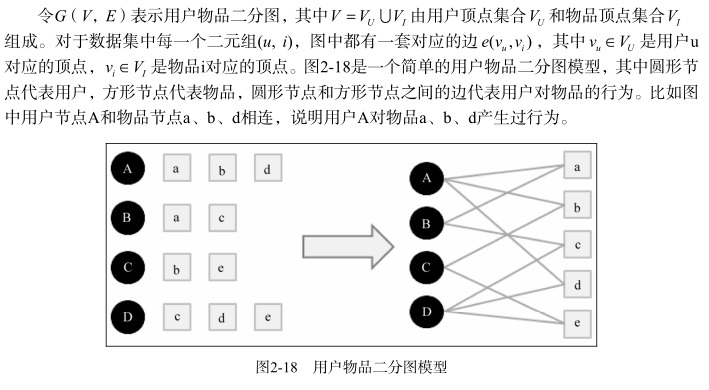

    用户行为很容易用二分图表示，因此很多图的算法都可以用到推荐系统中
    
#### 用户行为数据的二分图表示
- 基于图的模型是推荐系统中的重要内容。
- 多研究人员把**基于邻域**的模型也称为**基于图的模型**，因为可以把基于邻域的模型看做基于图的模型的简单形式
- 

#### 基于图的推荐算法
- 将用户行为表示为二分图模型后，下面的任务就是在二分图上给用户进行个性化推荐。
- 如果将个性化推荐算法放到二分图模型上，那么给用户 u
  推荐物品的任务就可以转化为度量用户顶点 v u 和与 v u
  没有边直接相连的物品节点在图上的相关性，相关性越高的物品在推荐列表中的权重就越高。
  
- 度量图中两个顶点之间相关性的方法很多，但一般来说图中顶点的相关性主要取决于下面3个因素：
  - 两个顶点之间的**路径数**；
  - 两个顶点之间**路径的长度**；
  - 两个顶点之间**路径经过的顶点**
  
- 相关性高的一对顶点一般具有如下特征：
  -  两个顶点之间有很多路径相连；
  -  连接两个顶点之间的路径长度都比较短；
  -  连接两个顶点之间的路径不会经过出度比较大的顶点
