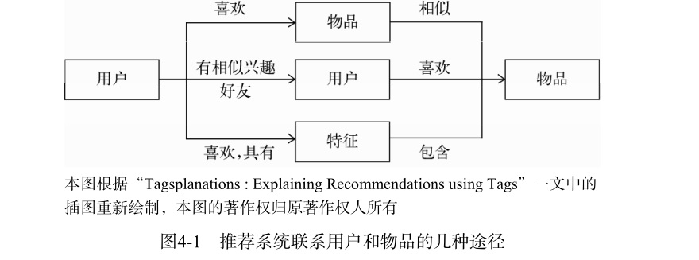

    通过三种方式联系用户兴趣和物品：
    - 利用用户喜欢过的物品，给用户推荐与他喜欢过的物品相似的物品——基于物品的算法。
    - 利用和用户兴趣相似的其他用户，给用户推荐那些和他们兴趣爱好相似的其他用户喜欢的物品——基于用户的算法。
    - 通过一些特征联系用户和物品，给用户推荐那些具有用户喜欢的特征的物品。
    
    特征：属性集合、隐语义向量、标签
    

    
根据给物品打标签的人的不同，标签应用一般分为两种：
- 让作者或者专家给物品打标签
- 让普通用户给物品打标签（UGC:User Generated Content，用户生成的内容）

UGC 标签系统是一种表示用户兴趣和物品语义的重要方式。

UGC 标签系统的代表应用>>>

#### Delicious

Delicous可算是标签系统里的开山鼻祖，它允许用户给互联网上的**每个网页**打标签，从而通
过标签重新组织整个互联网。

#### CiteULike

CiteULike是一个著名的论文书签网站，它允许研究人员提交或者收藏自己感兴趣的论文并
且给论文打标签，从而帮助用户更好地发现和自己研究领域相关的优秀论文。

#### Last.fm

Last.fm是一家著名的音乐网站，它通过分析用户的听歌行为预测用户对音乐的兴趣，从而给
用户推荐个性化的音乐。

#### 豆瓣

豆瓣是中国著名的评论和社交网站，同时也是中国个性化推荐领域的领军企业之一。豆瓣在
个性化推荐领域进行了广泛尝试，标签系统也是其尝试的领域之一。

#### Hulu

Hulu是美国著名的视频网站。视频作为一种最为复杂的多媒体，获取它的内容信息是最困难
的，因此Hulu也引入了用户标签系统来让用户对电视剧和电影进行标记。