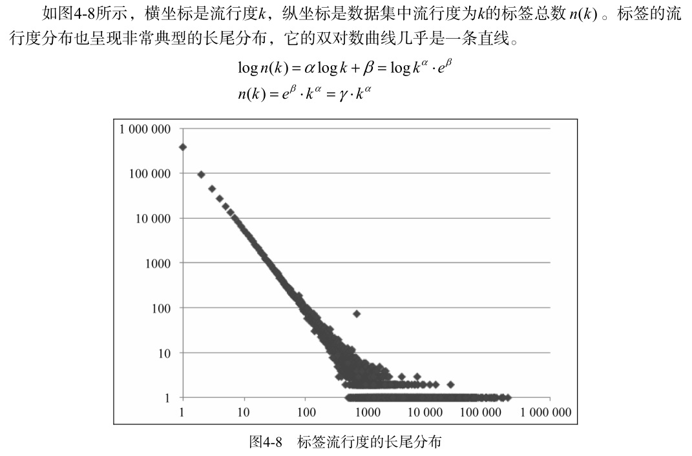

标签系统中的推荐问题主要有以下两个:
- 如何利用用户打标签的行为为其推荐物品（基于标签的推荐）
- 如何在用户给物品打标签时为其推荐合适该物品的标签（标签推荐）

需要知道3个问题：
- 用户为什么要打标签？
- 用户怎么打标签？
- 用户打什么样的标签

#### 用户为什么进行标注

**社会维度**：
- 给内容上传者使用的（便于上传者组织自己的信息）
- 给广大用户使用的（便于帮助其他用户找到信息）

**功能维度**：
- 用于更好地组织内容，方便用户将来地查找
- 用于传达某种信息，比如照片的拍摄时间和地点

#### 用户如何打标签

#### 用户打什么样的标签

- 表明物品是什么
- 表明物品的种类
- 表明谁拥有物品
- 表达用户的观点
- 用户相关的标签
- 用户的任务
- 类型
- 时间
- 人物
- 地点
- 语言
- 奖项
- 其他

